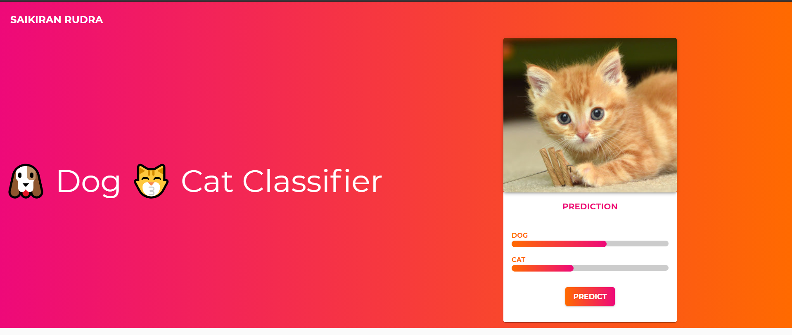

# Dockerised React and Flask based Dog Cat Classifier

## Output


## Technologies Used

1. React js
2. Flask 
3. Docker
4. Docker Compose

## How to start application
just one commande to start application

```commandline
docker-compose up
```
